# Cursor Rules — Smart Development Assistant

### Rules — How they guide our development (for humans)
This document explains the "Rules" used by the assistant to interpret your requests and choose the right workflow. It is intentionally short, visual, and practical.

### TL;DR
- 🧭 **Purpose**: turn any request into the right action plan with clear guardrails
- 🏷️ **First move**: always classify the request with confidence level (cleanup, feature, bugfix, exploration, migration, optimization, compliance)
- 🎯 **Smart routing**: lightweight front-end routes to specialized rules based on intent analysis
- ✅ **Finally**: implement small edits, run lint/tests/build, and summarize impact

### Decision Flow

```mermaid
flowchart TD
 A[📥 User request] --> B[🔍 Context Analysis]
 B --> C[🧩 Hierarchical Classification]
 C --> D{🎯 Confidence Level}
 
 D -->|High >80%| E[Direct Routing]
 D -->|Medium 50-80%| F[Confirm Choice]
 D -->|Low <50%| G[Ask Clarification]
 
 F --> H[User Confirmation]
 G --> I[Targeted Questions]
 H --> E
 I --> E
 
 E --> J{📋 Category Router}
 
 J -->|Priority 1| K1[🛠️ Bugfix - Strict Mode]
 J -->|Priority 2| K2[🔒 Compliance - Documented Requirements]
 J -->|Priority 3| K3[🧪 Exploration - Flexible Mode]
 J -->|Priority 4| K4[⚡ Optimization - Evidence Based]
 J -->|Priority 5| K5[🚚 Migration - Risk Assessment]
 J -->|Priority 6| K6[🧽 Cleanup - Reduction Only]
 J -->|Default| K7[✨ Feature - SOLID Compliant]
 
 K1 --> L[🔄 Smart Validation Rules]
 K2 --> L
 K3 --> L
 K4 --> L
 K5 --> L
 K6 --> L
 K7 --> L
 
 L --> M{🚨 Rule Violation?}
 M -->|Yes| N[Intelligent Redirect]
 M -->|No| O[🧾 Execute Specialized Rules]
 
 N --> J
 O --> P[🔁 Run lint / test / build]
 P --> Q[📊 Validate success metrics]
 Q --> R[🧩 Output: Summary + Evidence]
```


### Hierarchical Classification (Priority Order)
1. **🛠️ BUGFIX**: Dysfonctionnement rapporté ou erreur existante
2. **🔒 COMPLIANCE**: Obligation légale/audit/sécurité documentée  
3. **🧪 EXPLORATION**: Question technique à valider avec POC
4. **⚡ OPTIMIZATION**: Performance mesurée insuffisante avec profiler
5. **🚚 MIGRATION**: Changement technologique/version forcé
6. **🧽 CLEANUP**: Code existant à nettoyer sans nouvelle fonctionnalité
7. **✨ FEATURE**: Toute nouvelle fonctionnalité (default fallback)

### Ambiguity Resolution
- **Multiple matches**: Choose highest priority + confirm: *"Detected [X] but also [Y]. Proceeding with [X] - correct?"*
- **No clear match**: Offer 3 specific options: *"Could be: A) Fix bug B) Add feature C) Clean code. Which?"*
- **Context needed**: Ask targeted questions: *"Is there a current malfunction? Adding something new? Cleaning existing?"*

### Specialized Rules (Modular Approach)
Each category has dedicated rules optimized for that specific context:

- **🧽 Cleanup**: Never create files, user approval for deletions, measure before/after
- **✨ Feature**: Extend before create, preserve SOLID principles, justify new files
- **🛠️ Bugfix**: Max 5 lines changed, no improvements, regression prevention
- **🧪 Exploration**: Mark TEMP, mandatory cleanup, validation criteria
- **🚚 Migration**: Risk-based approach (direct vs phased), rollback ready
- **⚡ Optimization**: Profiler evidence required, 20% minimum improvement
- **🔒 Compliance**: Document legal requirement, minimal implementation

### Smart Validation & Redirects
Instead of hard stops, intelligent redirections:
- *"I detected you need to CREATE [specific thing]. This requires @feature-rules.md. Should I switch and help you implement [specific thing] properly?"*
- *"This bug exposes architectural issue. Should I fix minimal bug now and create separate task for architectural improvement?"*

### Adaptive Constraints
- **Strict mode**: Production code, zero tolerance for violations
- **Flexible mode**: Exploration/prototype, justified exceptions allowed  
- **Context adaptation**: Adjusts strictness based on category and urgency signals

### Universal Safeguards (SOLID + DRY + KISS + YAGNI)
- **Debt prevention**: clear problem statement, modify > create, measure complexity impact
- **Quality gates**: file ≤800, class ≤300, function ≤50; tests pass; no dead code
- **Operations**: run lint/test/build after edits; no sensitive leaks
- **Types**: no explicit any in prod; tests can warn; prefer unknown + type guards

### Output Schemas
```javascript
// Classification with confidence
CategoryDetection: {
  category: "bugfix|feature|cleanup|exploration|migration|optimization|compliance",
  justification: "string ≤100 chars",
  confidence: "percentage",
  keywords_found: ["array"]
}

// Execution plan
ActionPlan: {
  actions: ["specific steps"],
  file_impact: "decrease|same|increase_justified|increase_temporary", 
  risk_level: "low|medium|high",
  success_metrics: ["measurable outcomes"]
}
```

### FAQ
- **Multiple keywords?** Follow hierarchical priority, confirm if medium confidence
- **Ambiguous intent?** Max 3 targeted questions, avoid choice paralysis  
- **Rule conflicts?** SOLID principles override YAGNI when architecture at stake
- **CI/infra changes?** Adjust minimally to pass quality gates under current guardrails
- **Confidence system?** >80% proceed, 50-80% confirm, <50% clarify

### Architecture Benefits
✅ **Lightweight front-end**: Fast classification, minimal context pollution  
✅ **Specialized depth**: Expert rules loaded only when needed  
✅ **Self-healing**: Smart redirects prevent dead-ends  
✅ **Evidence-based**: All decisions backed by measurable criteria  
✅ **SOLID-compliant**: Architecture principles enforced consistently