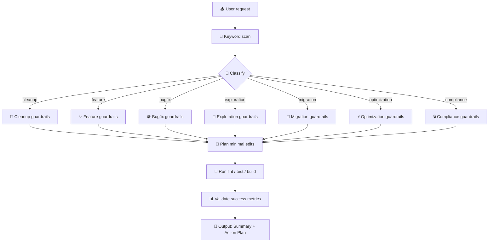

### Rules — How they guide our development (for humans)

This document explains the “Rules” used by the assistant to interpret your requests and choose the right workflow. It is intentionally short, visual, and practical.

### TL;DR
- 🧭 Purpose: turn any request into the right action plan with clear guardrails.
- 🏷️ First move: always classify the request (cleanup, feature, bugfix, exploration, migration, optimization, compliance).
- ✅ Finally: implement small edits, run lint/tests/build, and summarize impact.

### Decision Flow

### Categories
- 🧽 Cleanup, ✨ Feature, 🛠️ Bugfix, 🧪 Exploration, 🚚 Migration, ⚡ Optimization, 🔒 Compliance
If ambiguous: pick dominant objective. If unclear: ask 1–3 concise questions. Default: bugfix.

### Guardrails (examples)
- Cleanup: no new files/abstractions, complexity ↓
- Feature: follow patterns, growth justified
- Bugfix: smallest change, no refactor
- Exploration: mark experimental, plan cleanup
- Migration: prepare → migrate → cleanup old
- Optimization: benchmark before/after
- Compliance: minimal addition to comply

### Universal safeguards
- Debt: clear problem, modify > create, measure complexity
- Quality: file ≤ 800, class ≤ 300, function ≤ 50; tests must pass; no dead code
- Ops: run lint/test/build after edits; no secret leaks
- Types: no explicit any in prod; tests can warn; prefer unknown + type guards

### Outputs
- CategoryDetection: { category, short justification (≤100), keywords_found }
- ActionPlan: { actions[], file_impact, risk_level }

### FAQ
- Ban any? Avoid in prod; allow locally in tests/mocks.
- Multiple asks? Pick dominant category; ask up to 3 questions if needed.
- CI/infra? Adjust only to pass quality gates under current guardrails.
